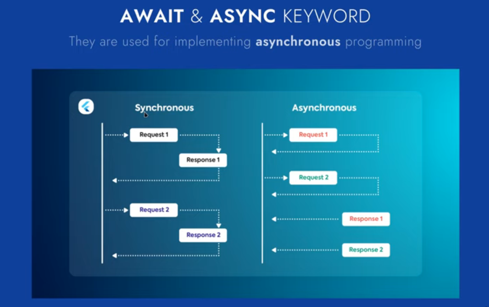

# **Final Mini Project - Chat Application**

---

## CSE443 Seminar on Summer Training

- Credit: 3
- LTP: 0 - 0 - 6
- Schedule: External Viva
- Duration: 6

---

## Coding Principles Followed

- Comments for better understanding
- Functional Programming techniques to avoid lengthy codes
- Error Handling Techniques to prevent errors and exceptions
- Simple and easy to understand project structure
- Prevention of Repetition of Code
- Use of Object Oriented Programming and Functional Programming

---

## Features of the Application

- Custom App Name and Custom App Icon
- Splash Screen
- Google Firebase Integration
- Google Sign In (Login Screen) with Firebase

    ```dart
    import 'package:google_sign_in/google_sign_in.dart';
    
    Future<UserCredential> signInWithGoogle() async {
      // Trigger the authentication flow
      final GoogleSignInAccount? googleUser = await GoogleSignIn().signIn();
    
      // Obtain the auth details from the request
      final GoogleSignInAuthentication? googleAuth = await googleUser?.authentication;
    
      // Create a new credential
      final credential = GoogleAuthProvider.credential(
        accessToken: googleAuth?.accessToken,
        idToken: googleAuth?.idToken,
      );
    
      // Once signed in, return the UserCredential
      return await FirebaseAuth.instance.signInWithCredential(credential);
    }
    ```

- Home Screen
  - Circular Progress Indicator while the data loads
  - User who has joined has no available connections. Handling this error.
  - Show the chats of the user
- Full Screen Mode and Fixed Orientation (Portrait Mode)

    ```dart
    //Settings for opening the app in full-screen mode and in portrait orientation
      SystemChrome.setEnabledSystemUIMode(SystemUiMode.immersiveSticky);
      SystemChrome.setPreferredOrientations(
              [DeviceOrientation.portraitUp, DeviceOrientation.portraitDown])
          .then((value) async {
        //Code for Flutter Firebase initialization
        await Firebase.initializeApp(
          options: DefaultFirebaseOptions.currentPlatform,
        );
        runApp(const MyApp());
      });
    ```

- Handling error when not connected with internet
- Handling errors when user not verified
- Uses Google Sign In as Login Interfaces
- Progress Bars and Indicator for delays in processing
- where clause to get chat users data (except our-self) & also get an specific doc from Firestore database using dart codes.
- Show profile pictures of users in our chat user card using a package called `CachedNetworkImage` (which handles unnecessary error caused by `Image.network` while loading too many resources).
- User interface for profile screen (aka account details screen) using dart language.
- Sign-out functionality for our chatting app
- Update profile information of our chat user & also fix some issues like hiding keyboard on tap of screen while editing in text field & widget overflow warning.
- Chat user searching feature in top app bar inside our StreamBuilder
- `WillPopScope` widget (to override back button press according to our needs) & also implement hide soft keyboard feature (removing focus from text input field) when user taps anywhere on screen..
- Create a round-cornered or curved `modalBottomSheet` for our profile picture selection feature.
- Profile picture picking feature from gallery as well as camera in our application.
- We will enable Firebase Storage for storing media files (i.e., images, audio, etc.) & also update Firebase write rules for keeping our writing operations enabled. Cloud Firestore can only store text for us. We need a different database to store files and images.
- Upload files or more specifically images to our Firebase Storage & complete the functionality of profile picture update.
- User interface for text input field with emoji button, message input, gallery button, camera button & message send button (bit similar to WhatsApp).
- A custom dart model for representing a single message information (with null safety).
- User interface for our message card (without using any external package or anything, simply using `Container` & `Row` widget).
- Feature to send and receive real-time chat messages using our Firebase Firestore & Stream (`StreamBuilder`).
- Provide functionality to message read or not read feature and show double blue ticks for read messages.
- Show last (latest or most recent) message & last message time of a chat conversation in user card & we will also show a green dot for unread user messages.
- Implement emoji selection feature (showing custom emoji keyboard) using `emoji_picker_flutter` package.
- Add feature to capture picture from phone camera and send it as chat message (using `image_picker`, Firebase Storage, Firebase Firestore & `cached_network_image` package).
- Implement multi-image or picture picking feature & send those as chat message (using Firebase Firestore, Firebase Storage, `image_picker`, etc.) & We will also show the last message as first in messages list.
- Implement user active or inactive status in chat screen as well as also show the last active time of user.
- Design UI for view profile picture screen for sender (or our connections).
- Design a custom alert dialog with curved border & transparent background for view user profile feature similar to WhatsApp.
- Enable push notifications in Firebase Cloud Messaging & also learn how we can get FCM registration token (i.e., push token) & also learn how to send a test notification to our device.
- Implement copy message text feature directly to clipboard of keyboard & also implement delete message (or document) feature.
- Learn how to save or download an online image from URL directly into phone's gallery or photos using `gallery_saver` package & handle its permission too.
- Add update chat message feature into our app (with the help of `.update()` function of Firebase database).
- Create structure for adding a specific chat user (not to all users of database) & create a custom add user dialog.

---

## Screenshots

| Login Screen  | Google Sign Up Screen |
|:-------:|:-------:|
|  | |

| Home Screen  | Other User Dialog Box |
|:-------:|:-------:|
|  | |

| Other User Profile Screen | Chat Screen |
|:-------:|:-------:|
|  | |

| Chat Editing Options and Info | Insert Emojis Functionality  |
|:-------:|:-------:|
|  | |

| User Profile Screen  | User Profile Screen Editing Options |
|:-------:|:-------:|
|  | |

---

## **Tech Stack Used**

- **Flutter**: An open-source UI software development toolkit created by Google. It is used to build natively compiled applications for mobile, web, and desktop from a single codebase.

- **Dart**: A programming language optimized for building mobile, desktop, server, and web applications. It is the primary language used in Flutter development.

- **Google Firebase**: A platform developed by Google for creating mobile and web applications. It provides various tools and services for app development, including real-time databases, authentication, analytics, and more.

- **Android Studio**: An integrated development environment (IDE) used for Android development. It provides tools for writing, debugging, and testing applications, and supports Flutter development with the right plugins.

- **Google Cloud Firestore Database**: A scalable, flexible database for mobile, web, and server development from Firebase and Google Cloud Platform. It allows real-time synchronization and offline support for applications.

- **Google Firestore Storage**: Part of Firebase, it provides cloud storage for storing and serving user-generated content such as photos and videos. It integrates seamlessly with other Firebase services.

- **JsonToDart Converter**: A tool to convert JSON data into Dart classes. It simplifies the process of parsing and manipulating JSON data within a Flutter application. [JsonToDart Converter](https://www.webinovers.com/web-tools/json-to-dart-convertor)

- **Firebase Notification Messages**: A service provided by Firebase Cloud Messaging (FCM) to send notifications and messages to users across various platforms. It allows the app to deliver notifications and updates to users even when the app is not actively in use.

---

## **YouTube Playlist and Videos**

- [YouTube Playlist](https://youtube.com/playlist?list=PL8kbUJtS6hyal7Uw7wTeYmv7yiNPH5kOq&si=ic-JriBvqzTyxK3X)
- [Video: Flutter Chat App](https://youtu.be/5xU5WH2kEc0?si=qcm1tCNuJEQoVzak)
- [StreamBuilder (Flutter Widget of the Week)](https://youtu.be/MkKEWHfy99Y?si=do25EoU8gKeINJz5)

---

## **Asset Websites and Resources**

- FlatIcon Website for Chat App Icon: [FlatIcon](https://www.flaticon.com/)

    ```html
    //App Icon
    <a href="https://www.flaticon.com/free-icons/online-chat" title="online chat icons">Online chat icons created by surang - Flaticon</a>
    
    //Google Icon
    <a href="https://www.flaticon.com/free-icons/google" title="google icons">Google icons created by Freepik - Flaticon</a>
    
    //Add Image Icon
    <a href="https://www.flaticon.com/free-icons/insert" title="insert icons">Insert icons created by Smashicons - Flaticon</a>
    
    //Camera Icon
    <a href="https://www.flaticon.com/free-icons/camera" title="camera icons">Camera icons created by DinosoftLabs - Flaticon</a> 
    ```

## **Documentation**

- [Flutter Animation Documentation](https://docs.flutter.dev/ui/widgets/animation) - Referred for simple animations
- [Firebase CLI Documentation](https://firebase.google.com/docs/cli?hl=en&authuser=0&_gl=1*ao0f8t*_ga*MTIxMzY4MjcyMi4xNzI0MzYyNzE5*_ga_CW55HF8NVT*MTcyNDM2MjcxOS4xLjEuMTcyNDM2MzAyOS42MC4wLjA.#mac-linux-npm) - Referred for Firebase setup in Android Studio
- [Firebase Cloud Messaging Documentation](https://firebase.google.com/docs/cloud-messaging/flutter/client) - For push notifications
- [Firebase Federated Auth Documentation](https://firebase.google.com/docs/auth/flutter/federated-auth) - For Google Sign In documentation
- [Flutter Auth Documentation](https://pub.dev/packages/firebase_auth) - Firebase Auth Plugin
- [Google Sign-In Documentation](https://pub.dev/packages/google_sign_in) - Google Sign-In Plugin
- [Firebase Storage Documentation](https://pub.dev/packages/firebase_storage) - Firebase Storage Plugin
- [Image Picker Documentation](https://pub.dev/packages/image_picker) - Image Picker Plugin
- [Cached Network Image Documentation](https://pub.dev/packages/cached_network_image) - Cached Network Image Plugin
- [Emoji Picker Flutter Documentation](https://pub.dev/packages/emoji_picker_flutter) - Emoji Picker Plugin
- [Gallery Saver Documentation](https://pub.dev/packages/gallery_saver) - Gallery Saver Plugin
- <https://docs.flutter.dev/ui/widgets/animation>
  - Link - [https://docs.flutter.dev/ui/widgets/animation](https://docs.flutter.dev/ui/widgets/animation)
  - Use - Referred for simple animations
- Link - [https://firebase.google.com/docs/cli?hl=en&authuser=0&_gl=1*ao0f8t*_ga*MTIxMzY4MjcyMi4xNzI0MzYyNzE5*_ga_CW55HF8NVT*MTcyNDM2MjcxOS4xLjEuMTcyNDM2MzAyOS42MC4wLjA.#mac-linux-npm](https://firebase.google.com/docs/cli?hl=en&authuser=0&_gl=1*ao0f8t*_ga*MTIxMzY4MjcyMi4xNzI0MzYyNzE5*_ga_CW55HF8NVT*MTcyNDM2MjcxOS4xLjEuMTcyNDM2MzAyOS42MC4wLjA.#mac-linux-npm)
  - Use - Referred for Firebase setup in Android Studio
- <https://firebase.google.com/docs/cloud-messaging/flutter/client> - [https://firebase.google.com/docs/cloud-messaging/flutter/client](https://firebase.google.com/docs/cloud-messaging/flutter/client)
- <https://firebase.google.com/docs/cloud-messaging/flutter/receive> - [https://firebase.google.com/docs/cloud-messaging/flutter/receive](https://firebase.google.com/docs/cloud-messaging/flutter/receive)
- [https://firebase.google.com/docs/auth/flutter/federated-auth](https://firebase.google.com/docs/auth/flutter/federated-auth) (For Google Sign In documentation)
- Flutter auth: [https://pub.dev/packages/firebase_auth](https://www.youtube.com/redirect?event=video_description&redir_token=QUFFLUhqbnltdGQ0ZU8tb091VVA1OFdCcU5CZmpfTlJ6UXxBQ3Jtc0tuU3EtMldTTjc0dE9xdE9SNTlHVzJQRHVOOXpEX3VCT2FEQ25nU2pVZW5vWGlMY0daZ3BlNDJ5ZmlMQ0lQTEx0YUI0NEVvM0EzUlZvN2YwMVlrWVB6ZjBGdms3dnNqSUR1b0pTdEZZQTJHTE50TkFuRQ&q=https%3A%2F%2Fpub.dev%2Fpackages%2Ffirebase_auth&v=jddB0lVNT_8)
- Google Sign-In: [https://pub.dev/packages/google_sign_in](https://www.youtube.com/redirect?event=video_description&redir_token=QUFFLUhqa0pmNDFBLUFCRFRBOXkybE9OaEVqdzdNd1dKd3xBQ3Jtc0ttQVFLMlhteVFSWWJwMzJnUnVHcHJxMW5YQ2YzQk1GUjN5N3NLYUtScWRNSHQtaGpWZkhoaHBhaHJldjliWFVsV2NlU0xjS3BSbDNJWlU5UUxjbXlSRHU5YU5jV0VjUUNFWV8ybFBxY2tsM0ZGdzFKZw&q=https%3A%2F%2Fpub.dev%2Fpackages%2Fgoogle_sign_in&v=jddB0lVNT_8)
- Firebase Google Sign-In doc: [https://firebase.google.com/docs/auth...](https://www.youtube.com/redirect?event=video_description&redir_token=QUFFLUhqazlUSW1sYlhIRUJHUllHeFFOM25rSmpDT3ZCZ3xBQ3Jtc0tsQ1B3NElPVWdkRjBWQmgybE8xVnNsSlN5Ym5tSDI1UnhjLVhIWkpUY0UxRXM2NHdxVHVzV2ttdzBOVjI2bXhDYjZLVFlHTmYyWldpMVR5U1RpNDlvSVFRS2RLVVFyZVJQSlRJVVNjUjdjdDgxT2g0OA&q=https%3A%2F%2Ffirebase.google.com%2Fdocs%2Fauth%2Fflutter%2Ffederated-auth&v=jddB0lVNT_8)
- SHA1 key using Android Studio (From Duration -- [4:50](https://www.youtube.com/watch?v=jddB0lVNT_8&list=PL8kbUJtS6hyal7Uw7wTeYmv7yiNPH5kOq&index=12&t=290s)): <https://youtu.be/NDSOJ9PV2kg?si=ggJFRFugSFDvFxBJ>

---

### Flutter Packages Used

1. `flutter_launcher_icons: ^0.13.1`
    - Documentation - [flutter_launcher_icons](https://pub.dev/packages/flutter_launcher_icons)
    - Install Command - `flutter pub add flutter_launcher_icons`
    - Usage - A command-line tool which simplifies the task of updating your Flutter app's launcher icon. Fully flexible, allowing you to choose what platform you wish to update the launcher icon for and if you want, the option to keep your old launcher icon in case you want to revert back sometime in the future.

2. `firebase_core: ^3.3.0`
    - Documentation - [firebase_core](https://pub.dev/packages/firebase_core)
    - Install Command - `flutter pub add firebase_core`
    - Usage - Flutter plugin for Firebase Core, enabling connecting to multiple Firebase apps.
  
3. `firebase_auth: ^5.0.1`
    - Documentation - [firebase_auth](https://pub.dev/packages/firebase_auth)
    - Install Command - `flutter pub add firebase_auth`
    - Usage - Flutter plugin for Firebase Authentication. Flutter plugin for Google Sign-In, a secure authentication system for signing in with a Google account.

4. `cloud_firestore: ^5.2.0`
    - Documentation - [cloud_firestore](https://pub.dev/packages/cloud_firestore)
    - Install Command - `flutter pub add cloud_firestore`
    - Usage - Flutter plugin for Cloud Firestore, a cloud-hosted, NoSQL database with live synchronization and offline support on Android and iOS.

5. `firebase_storage: ^11.4.1`
    - Documentation - [firebase_storage](https://pub.dev/packages/firebase_storage)
    - Install Command - `flutter pub add firebase_storage`
    - Usage - A Flutter plugin to use the Firebase Cloud Storage API. Flutter plugin for Firebase Cloud Storage, a powerful, simple, and cost-effective object storage service for Android and iOS.

6. `google_sign_in: ^6.2.1`
    - Documentation - [google_sign_in](https://pub.dev/packages/google_sign_in)
    - Install Command - `flutter pub add google_sign_in`
    - Usage - Flutter plugin for Google Sign-In, a secure authentication system for signing in with a Google account.

7. `cached_network_image: ^3.2.1`
    - Documentation - [cached_network_image](https://pub.dev/packages/cached_network_image)
    - Install Command - `flutter pub add cached_network_image`
    - Usage - A flutter library to show images from the internet and keep them in the cache directory. Flutter library to load and cache network images. Can also be used with placeholder and error widgets.

8. `image_picker: ^1.0.5`
    - Documentation - [image_picker](https://pub.dev/packages/image_picker)
    - Install Command - `flutter pub add image_picker`
    - Usage - Flutter plugin for picking images from the image library or taking new pictures with the camera.

9. `emoji_picker_flutter: ^1.2.1`
    - Documentation - [emoji_picker_flutter](https://pub.dev/packages/emoji_picker_flutter)
    - Install Command - `flutter pub add emoji_picker_flutter`
    - Usage - A Flutter package that provides an Emoji picker widget with 1500+ emojis in 8 categories.

10. `gallery_saver: ^2.0.2`
    - Documentation - [gallery_saver](https://pub.dev/packages/gallery_saver)
    - Install Command - `flutter pub add gallery_saver`
    - Usage - Saves images and videos from network or temporary file to external storage. Both images and videos will be visible in Android Gallery and iOS Photos.

---

### Shortcut Keys in Flutter

- Press `Ctrl + Space` (to be pressed inside the widget block) to get attribute suggestions inside the widget.
- `F2` Shortcut key to change the name in stateful or stateless class names in one go.

---

### Data Flow Diagrams

1. **Different Screens for the Application**
    1. Login Screen
    2. Home Screen
    3. Chat Screen
    4. Register Screen
    5. Settings Screen

| Main Screens  |
|:-------:|
|  |

2. **Checks for Login Screen**
    1. If the user is logged in → Proceed to the Home Page
    2. If the user is not logged in → Login
    3. If the user is not a valid user, register or sign up as a new user.

| Data Flow Between Screens |
|:-------:|
|  |

3. **For Data Store, Use Google Firestore**
    1. Data is collected for the number of users.
    2. Data is collected for individual  user chats.

| FireStore and Chat Screen  |
|:-------:|
|  |

---

### Steps to get SHA Certificate for Android

- Setup Google Sign-In Authentication in Google Firebase Console
- Move to Project Settings in the Android App of Firebase
- Migrate to end of it.
- In Editor, open a terminal and migrate to android folder. → use `cd android/` command.
- Execute command `./gradlew signingReport`

---

## Important Flutter Concepts Used

1. **Async and Await**
    - These are used for implementing asynchronous programming.
    - In synchronous programming suppose, I made an API request to a server. The request would be executed first and no other request can be executed in the meantime unless the response for the first request is received.
    - In asynchronous programming, requests can be made and would be tracked until the responses are received and once received, they would be executed. Many requests can be made at the same time. It reduces wait time for many API Requests

    | Await and Async Keyword|
    |:-------:|
    |  |

    - This reduces the total time for a process execution.

    | Synchronous and Asynchronous Requests|
    |:-------:|
    |  |

- `Async` in Flutter returns a Future object. → We don’t have the data right now, but in future once received the corresponding data, it would be notified to the application.
- `Async*` in Flutter returns a Stream object.
